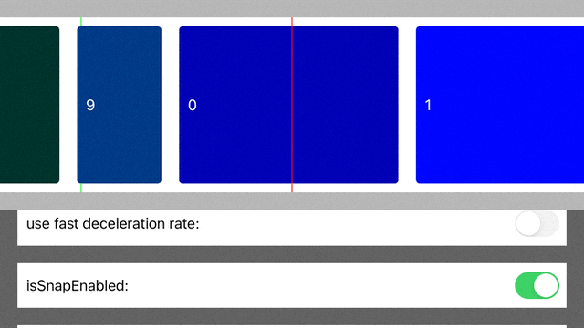

<br><br>
# InfinityScrollView


- [Requirements](#requirements)
- [Installation](#installation)
- [Usage](#usage)
- [License](#license)

Task Manager is a Swift library designed to manage asynchronous operations. The main purpose of the Task Manager component is to encapsulate work with the server, database, and other background operations into unit-like operations or tasks. This helps to separate business logic from UI and reuse operations across the app.


Infinity scroll example:


Infinity scroll example with different items sizes:


Infinity scroll example with snap to item center:




Single item behaviour:


## Requirements

- iOS 11.0+
- Xcode 11.0+
- Swift 5.0+

## Installation

### CocoaPods

To integrate Infinity Scroll View into your Xcode project with CocoaPods, specify it in your `Podfile`:

```ruby
pod 'Shakuro.InfinityScrollView'
```

Then, run the following command:

```bash
$ pod install
```

### Manually

If you prefer not to use CocoaPods, you can integrate Shakuro.InfinityScrollView simply by copying it to your project.

## Usage

1. Create a couple of operations by subclassing `BaseOperation`. An operation should be a complete and independent unit of business logic. 
2. Subclass `TaskManager` and override `.willPerformOperation()`. Define dependencies between operations in this method. It’s a good idea to create two separate `TaskManager` objects/subclasses: one to handle auth-related tasks and the second one for all other work.
3. Start your tasks by calling `.performOperation()` or `.performGroup()` on `TaskManager`. You can use completions  to handle results.

Have a look at the [InfinityScrollView_Example](https://github.com/shakurocom/InfinityScrollView/tree/main/InfinityScrollView_Example)

### Important notes

An operation should have `operationHash` defined if its work rely only on its options. Hash is used in `.willPerformOperation()` to construct dependencies.

Carefully consider the dependencies between operations. `.willPerformOperation()` should return an already existing in the queue (old) operation instead of a new one if both operations (old & new) are equal from the business logic perspective. This will result in only single operation being executed with multiple completion callbacks.

Each task (an operation or a group of operations) can have a `retryHandler` to perform a retry under specified conditions. It is a perfect tool if you are dealing with an unreliable server.

Usual flow: Interactor -> Options -> Task Manager (operations + dependencies inside) -> HTTP Client + Database -> Retry if error (for example session expired error) -> Completion block inside Interactor with typed result.

## License

Shakuro.InfinityScrollView is released under the MIT license. [See LICENSE](https://github.com/shakurocom/InfinityScrollView/blob/main/LICENSE.md) for details.

## Give it a try and reach us

Star this tool if you like it, it will help us grow and add new useful things. 
Feel free to reach out and hire our team to develop a mobile or web project for you.


